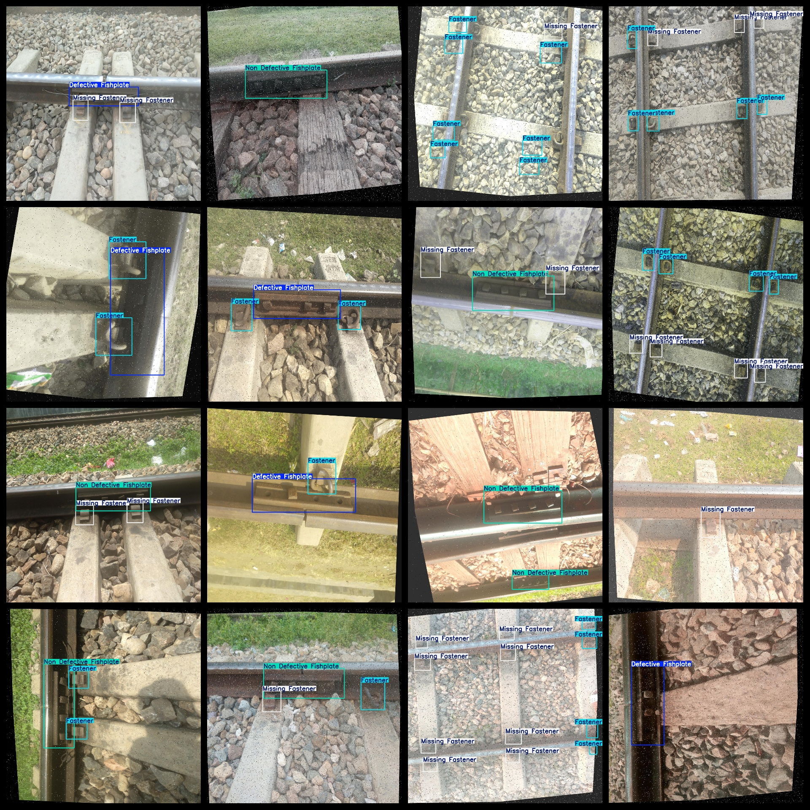

# Rail Fastener and Fishplate Missing Detection Dataset 4690 imagesVOC+YOLO format

The dataset of 4690 images of iron rail fasteners and fishtail plates missing detection is in VOC+YOLO format.

Dataset format: Pascal VOC format + YOLO format (the txt file does not contain the split path, it only contains jpg images and corresponding VOC format xml files and yolo format txt files)

Number of images (number of jpg files): 4690

Number of XML Files: 4690

Number of txt files: 4690

Number of annotated categories: 4

The Github repository is: datasets_sl

["Defective Fishplate", "Fastener", "Missing Fastener", "Non Defective Fishplate"]

Defected fish tail plates, fasteners, missing fasteners, non-defective fish tail plates

Number of boxes labeled in each category:

Defective Fishplate Frame Count = 1048

Fastener Frame Count = 12286

The number of missing fasteners = 6594

Non Defective Fishplate Frame Count = 1658

Total Frames: 21586

Number of images per category:

Defective Fishplate occupies a total of 1036 images.

Fastener occupies 2918 images.

Missing Fastener has 2236 images.

Non Defective Fishplate Ownership Image Count = 1549

Image resolution: 1280x1280

Use the labeling tool: labelImg

Dataset Augmentation: Yes

Rules for annotation: Draw a rectangle around the category.

Important note: The dataset does not have been divided into training, validation, and testing sets.

Special Disclaimer: This dataset does not guarantee the accuracy of the trained models or weight files.

Annotation and image details are as follows:

## Images

---

Here is a pay link on Stripe (https://buy.stripe.com/3cs8yP7sY87d0vu9AB). Please contact me lonlonago@foxmail.com after funding $89, and I will send you a complete data files, thank you!

